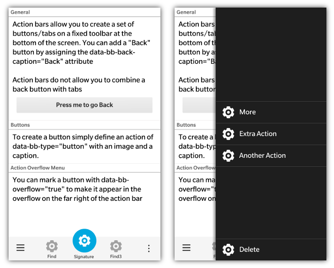
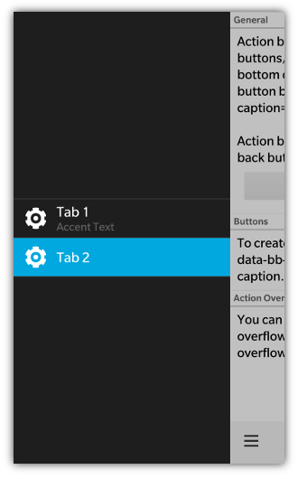

 
The BlackBerry 10 action bar allows for a combination of buttons and tabs.  _**Action Bars are currently only supported on PlayBook and BB10 devices**_. It is essentially a toolbar that appears at the bottom of the screen allowing for scrolling content above it. Action bars also allow you to navigate back to the previous screen using an optional built in back button.  

_NOTE: Combining a back button and tabs on an action bar is not allowed_

If you provide a **data-bb-back-caption** attribute on the action bar, a back button will automatically be created.  Each item on the bar is defined as a **data-bb-type="action"** and its type is defined by the **data-bb-style** attribute which can either be a "tab" or a "button".  Tabs automatically handle the highlighting of the selected tab.  it is recommended that you group your tabs and buttons together to provide a clean user interface. 

To set a tab's initial state to selected you can set its **data-bb-selected="true"** attribute.

```html
    <div data-bb-type="action-bar">
        <div data-bb-type="action" data-bb-style="tab" data-bb-overflow="true" data-bb-img="cog.png">Library</div>
        <div data-bb-type="action" data-bb-style="tab" data-bb-selected="true" data-bb-img="cog.png">Smart</div>
        <div data-bb-type="action" data-bb-style="button" data-bb-overflow="true" data-bb-img="cog.png">Find</div>
    </div>
```

### Initial Visibility

The initial visible state for an action (Button or Tab) can be set using the **data-bb-visible="false"** attribute.  By default the tab will be considered visible unless overridden by the data-bb-visible flag.  This flag works for both buttons or tabs on the main action bar, as well as actions on the tab and action overflow menus

```html
    <div data-bb-type="action-bar">
        <div data-bb-type="action" data-bb-style="tab" data-bb-visible="false" data-bb-img="cog.png">Library</div>
        <div data-bb-type="action" data-bb-style="tab" data-bb-img="cog.png">Music</div>
    </div>
```

### onclick

You can handle the selection of the action by assigning an **onclick** event handler. 

```html
    <div data-bb-type="action-bar">
        <div data-bb-type="action" data-bb-style="tab" data-bb-img="cog.png" onclick="alert('Library')">Library</div>
        <div data-bb-type="action" data-bb-style="button" data-bb-img="cog.png" onclick="alert('Find')">Find</div>
    </div>
```
	
### Image Sizes

Images used for Actions will be scaled to the following resolutions and centered on the action bar items.

* BlackBerry PlayBook - 40 x 40 pixels
* BlackBerry 10 - 100 x 100 pixels

## Action Bar Notes for Q10 on 10.2.1 and lower

When using the action bar on Q10 on 10.2.1 or lower you will notice that the captions for the buttons/tabs do not appear under the icons.  This is done by design to provide more usable screen space.  If the user does a press-and-hold on the action bar item, the caption will appear above the action.

## Signature Action
Starting with 10.3 the action bar allows for a signature action to be defined for the action bar.  This action will stand out and be centered on the action bar.  NOTE: A signature action cannot be used when you have visible tabs that are not in the tab overflow menu.  To define a signature action you simply use the **data-bb-signature="true"** attribute.

```html
<div data-bb-type="action" data-bb-style="button" data-bb-signature="true" data-bb-img="cog.png">My Caption</div>
```

This is what the signature action looks like placed on an action bar:

	
## Action Overflow Menu

You must explicitly mark each action item you wish to appear on the tab overflow or action overflow menus. This is accomplished by using the **data-bb-overflow="true"** attribute.  By adding this attribute to your button or tab action, it will appear on its associated overflow menu.  By default starting with BlackBerry 10.2 there will be the text "More" that will appear on this button by default.  If you want to localize that text you can set the **data-bb-more-caption** attribute of the action bar in the same manner that you would localize the Back button caption.

Only 5 "viewable" actions in total are allowed on the action bar at any time.  This total includes the system back button, tab overflow and action overflow buttons.  It's the developer's responsibility keep the "main actions" only in the Action bar and relegate other actions to the tab overflow and action overflow menus in order to make sure that the screen's main function is clear and the user is not distracted by secondary actions.

### "Pinning" an Overflow Action

There are scenarios where you have a specific action that you wish to call out in your action bar overflow menu as something different or special ("Delete" is a good example).  To make this action stand out it can be "pinned" to the bottom of the action overflow menu away from your other actions. This can be done by providing both the **data-bb-overflow="true"** and **data-bb-pin="true"** attributes for a button action.
```html
    <div data-bb-type="action-bar">
        <div data-bb-type="action" data-bb-style="button" data-bb-img="cog.png">Do Something</div>
        <div data-bb-type="action" data-bb-style="button" data-bb-overflow="true" data-bb-img="cog.png">Smart</div>
        <div data-bb-type="action" data-bb-style="button" data-bb-overflow="true" data-bb-pin="true" data-bb-img="cog.png">Delete</div>
    </div>
```

## Tab Overflow Menu

When you mark one or more tabs as an overflow action, the tab will appear in the tab overflow menu.  This will also create a tab overflow menu button on the far left of the action bar.  This tab overflow menu button uses up one of the 5 available visible action slots.

Tab overflows are meant for other parts of your screen that are not as common as the tabs which you decide to display on the action bar itself.  When a user presses the tab overflow menu button, a menu of all the available tabs will slide into display (both those marked for overflow and those that appear on the action bar).  When the user selects one of the tabs on the overflow menu it will fire the tab's _onclick_ event.

If the tab selected was one of the tab's marked as an overflow action, the tab overflow menu button will display the information for that action.  Moving back to a tab that was not marked as overflow will trigger the tab overflow menu button to go back to its initial state.

Tab overflow actions also have a **data-bb-accent-text** attribute that can be used to add complimentary text that will appear below the action title on the tab overflow.  This allows you to bring further context to your tab.

```html
<div data-bb-type="action-bar">
   <div data-bb-type="action" data-bb-style="tab" data-bb-img="cog.png" data-bb-accent-text="Bar">Foo</div>
</div>

```



## Action Bar JavaScript Interface
The following JavaScript interfaces are available for dynamically manipulating an Action Bar after the screen has been added to the DOM. 

### setBackCaption(value)

If your action bar has a **back** button you can set the caption of the button using **setBackCaption()**

```javascript
document.getElementById('actionBarID').setBackCaption('Return');
```

### setSelectedTab(value)

To change the current selected tab via JavaScript you can use the **setSelectedTab()** function by passing in the tab to be selected

```javascript
var tab = document.getElementById('myTab'),
    actionBar = document.getElementById('myActionBar');

actionBar.setSelectedTab(tab);
```

### show() and hide()

When you want to dynamically show or hide your action bar you can call it&apos;s **show()** and **hide()** functions.

```javascript
	document.getElementById('myActionBar').show();
	document.getElementById('myActionBar').hide();
```

## Action Button/Tab JavaScript Interface

The following JavaScript interfaces are available for dynamically manipulating an Action (tab/button) after the screen has been added to the DOM. 

### getCaption() and setCaption(value)

You can retrieve and set the caption of an action item (tab and button) by using the **getCaption()** and **setCaption()** functions.

```javascript
var myAction = document.getElementById('myAction');
myAction.setCaption('hello world');
alert(myAction.getCaption());
```

### getImage() and setImage(value)

You can retrieve and set the image of an action item by using the **getImage()** and **setImage()** functions

```javascript
var myAction = document.getElementById('myAction');
myAction.setImage('myimages/foo.png');
alert(myAction.getImage());
```

### show() and hide()

You can dynamically change the visibility of an anction by using the **show(), hide()** functions.  These apply to both actions on the main visible action bar, and for actions on the tab and action overflow.  

```javascript
var myAction = document.getElementById('myAction');
myAction.show();
myAction.hide();
```