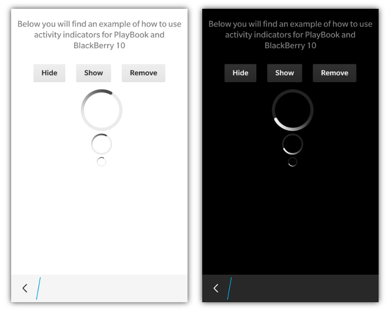

_NOTE: Activity indicators are only supported for BlackBerry 10 and PlayBook styling_

Activity Indicators are used to show your user that the application is currently "working" and there isn't a set period of time or min/max value that is trying to be reached.  Creating an activity indicator can be done by simply adding the **data-bb-type="activity-indicator"** to a &lt;div&gt;.
```html
    <div data-bb-type="activity-indicator" data-bb-size="large"></div>
```
You can also specify the size of activity indicator that you are looking for by setting the **data-bb-size** attribute to **"small", "medium" or "large"**.  If the size attribute isn't specified, the activity indicator will be displayed using the medium sizing by default.

## JavaScript Interface
The following JavaScript interfaces are available for dynamically manipulating an Activity Indicator after the screen has been added to the DOM

### show() and hide()

When you want to dynamically show or hide your activity indicator you can call it&apos;s **show()** and **hide()** functions.

```javascript
	document.getElementById('indicator').show();
	document.getElementById('indicator').hide();
```

### remove()

As a convenience you can also remove your activity indicator from the screen by calling the **remove()** function.

```javascript
	document.getElementById('indicator').remove();
```