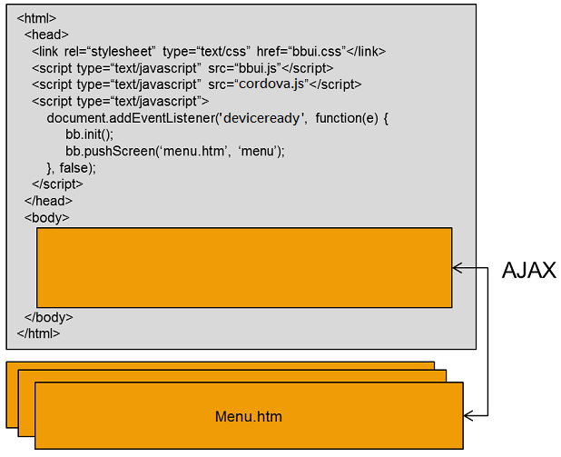

The bbUI toolkit is designed to progressively enhance its capability based on the abilities of the Web rendering engine 
on BB5/BB6/BB7/PlayBook and BlackBerry 10.  This means that in some cases toolbars are fixed, and in others they scroll with the content.  The CSS used to generate the user interface is handled by the bbUI toolkit so that you don't have to deal with the idiosyncrasies of the different layout engines.

Each of the layouts and controls use custom attributes that begin with **data-bb-** so that the toolkit can determine the type of control that is desired and then style it accordingly.  By not adding any kind of layout logic to the screen elements, bbUI can then modify the DOM in any way that it needs in order to achieve the desired result.

All DOM manipulation occurs while the HTML fragment is not attached to the **live DOM**.  This allows DOM manipulation to occur VERY, VERY, FAST and it does not incur any WebView layout computation until the entire fragment is inserted into the DOM.  Layout computation during JavaScript DOM manipulation is one of the single most expensive operations that can slow down a Web based UI.

Each screen you create is an **HTML fragment** that gets loaded into the application via AJAX to keep the size of the DOM small and memory usage to a minimum.

The structure of your application will look like one main index.htm which provides the framework for your application by loading in all the bbUI toolkit CSS and JavaScript, and then each screen will be an HTML fragment.

## What are HTML Fragments?
HTML fragments (or document fragments) are pieces of HTML that you place in separate files on a web server.  Or in this case a WebWorks application.  These are **not** full HTML documents that include things like &lt;head&gt; and &lt;body&gt; tags.  They are simply a document that contains a &lt;div&gt; which is to be displayed.

For bbUI, these HTML fragments are [individual screens](https://github.com/blackberry/bbUI.js/wiki/Screens).  In some other toolkits like jQuery Mobile, these screens sometimes are loaded into a single large document and then made visible/invisible when moving between screens.  This however creates a large DOM that is held in memory, even though your user may never enter those screens. By making each of these screens a separate file and only loading them on demand via _**AJAX**_ you reduce your memory overhead.

 

Even though each screen is a &lt;div&gt; you can still [load screen specific CSS and JavaScript](https://github.com/blackberry/bbUI.js/wiki/Screen-Specific-CSS-and-JavaScript) with each screen.  The bbUI toolkit will ensure that your screens CSS and JavaScript gets loaded, and unloaded when your screen is displayed and removed from the screen stack.

## How do I Load a Screen?
First step in creating a screen for your application is to create an HTML fragment file.  In this file you will create a [Screen Definition]((https://github.com/blackberry/bbUI.js/wiki/Screens)).  This is the basis of each screen that you will create in your application.

Before trying to load your first screen you will need to [initialize the bbUI toolkit](https://github.com/blackberry/bbUI.js/wiki/Toolkit-Initialization). Once the toolkit is initialized you can **push** your first screen.

The bbUI toolkit operates on a screen stack paradigm. You basically **push** and **pop** screens off the stack, and the top most screen on the stack is what is shown to the end user.  The pushing and popping of screens can be animated by setting the desired effect in your screen HTML fragment.  The bbUI toolkit handles all the popping or "Back" actions for you.  You can simply specify certain buttons to be "Back" buttons and the toolkit will handle the popping of the screen when the user selects that button.  On BlackBerry OS smartphones the physical "Back" hardware key is plumbed into bbUI using BlackBerry WebWorks APIs to automatically trap that user interaction and pop the current screen.  

Pushing a screen onto the stack is as simple as providing the path to the HTML fragment for the screen and a **unique id** for the screen in the stack.

```javascript
   bb.pushScreen('myscreen.htm', 'myUniqueId');

```

If you need to pass information to your screen you can also provide an optional third parameter.  This third parameter can be any object.  By supplying this parameter it will be passed to the [onscreenready and ondomready events](Toolkit-Initialization) every time the screen is loaded so that you can then retrieve its contents.

```javascript
   bb.pushScreen('myscreen.htm', 'myUniqueId', {'myid' : 23});

```

## Declarative vs JavaScript
At the moment bbUI is **VERY** declarative.  You create your screen HTML fragments, load them in and allow bbUI to style the screen to match the device user experience.  There are however a couple of ways to manipulate your screen both **before**, and **after** it has been loaded.

You can manipulate your screen's contents before the bbUI styling is applied by assigning a JavaScript function to the **onscreenready** event and manipulating the DOM of the HTML fragment.  You can also assign a JavaScript function to the **ondomready** event which will fire after your screen has been styled and inserted into the DOM. Both of these events are assigned during the [toolkit initialization](https://github.com/blackberry/bbUI.js/wiki/Toolkit-Initialization).

Manipulating the look and feel of the screen after it has been inserted into the DOM is still a bit challenging with bbUI.  The v0.9.4 milestone will go a long ways to make this better.  At the moment there are _some_ APIs provided on the different controls to update them while visible. 

## Need more bbUI How Tos?
If you are looking for more getting started information please feel free to log a github issue, or reach out to [@BlackBerryDev](https://twitter.com/BlackBerryDev) or [@brcewane](https://twitter.com/brcewane)