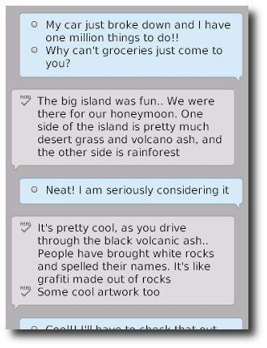

The BBM Bubbles UI format allows you to create chat bubbles that look like the ones in BBM. This is a great option for any BBM connected application.



A BBM bubble is created by adding a &lt;div&gt; with the **data-bb-type="bbm-bubble"** attribute.  You can set the direction of the bubble to either "right" or "left" by using the **data-bb-style** attribute.

The conversation line items that appear inside the BBM Bubble are simply &lt;div&gt;&apos;s that have the **data-bb-type="item"** attribute.  You can also specify an image to appear beside the line item by using the **data-bb-img** attribute. The contents of the line item &lt;div&gt; will be displayed as the line item text.
```html
	<div data-bb-type="screen">
		<style type="text/css">
			body,html {
				background-color: #B5B2B5;
			}	
		</style>
		<div data-bb-type="bbm-bubble" data-bb-style="right">
			<div data-bb-type="item" data-bb-img="bullet.png">My car just broke down and I have one million things to do!!</div> 
			<div data-bb-type="item" data-bb-img="bullet.png">Why can&apos;t groceries just come to you?</div> 
		</div>
		<div data-bb-type="bbm-bubble" data-bb-style="left">
			<div data-bb-type="item" data-bb-img="read.png">The big island was fun.. We were there for our honeymoon.  One side of the island is pretty much desert grass and volcano ash, and the other side is rainforest</div> 
		</div>
	</div>
```

## JavaScript Interface
The following JavaScript interfaces are available for dynamically manipulating a BBM Bubble after the screen has been added to the DOM

### Dynamic Styling

A BBM bubble can be created dynamically to be inserted into a screen that is already in the live DOM (after the ondomready event has fired for the screen).  This allows you to dynamically create bubbles on the fly based on user interaction.  It is accomplished by using the **bb.bbmBubble.style()** function.

```javascript
// Create BBM bubbles list
var bubble = document.createElement('div');
bubble.setAttribute('data-bb-type','bbm-bubble');
bubble.setAttribute('data-bb-style','right');

var item = document.createElement('div');
item.setAttribute('data-bb-type', 'item');
item.setAttribute('data-bb-img', 'foo.png');
item.innerHTML = 'Hello World';
bubble.appendChild(item);

bubble = bb.bbmBubble.style(bubble);

document.getElementById('bubbleContainer').appendChild(bubble);
```

### show() and hide()

When you want to dynamically show or hide your BBM bubble you can call it&apos;s **show()** and **hide()** functions.

```javascript
document.getElementById('myBubble').show();
document.getElementById('myBubble').hide();
```

### remove()

As a convenience you can also remove your BBM bubble from the screen by calling the **remove()** function.

```javascript
document.getElementById('myBubble').remove();
```

### getStyle() and setStyle(value)

At any point that you wish to read or change the direction/style of the bubble from left to right you can use the **getStyle()** and **setStyle()** functions.

```javascript
document.getElementById('myBubble').setStyle('left');
document.getElementById('myBubble').setStyle('right');

alert(document.getElementById('myBubble').getStyle());
```

### clear()

As a convenience you can also clear all the items from your BBM bubble by calling the **clear()** function.

```javascript
document.getElementById('myBubble').clear();
```

### getItems()

You can also retrieve all of the items included in the BBM Bubble by calling the **getItems()** function.  This will return an array of line items from the bubble.

```javascript
var items = document.getElementById('myBubble').getItems(),
    i;
for (i = 0; i < items.length; i++) {
    // Do something with the items
}
```

## Bubble Item JavaScript Interface
The following JavaScript interfaces are available for dynamically manipulating a BBM Bubble **Item** after the screen has been added to the DOM

### getCaption() and setCaption(value)

At any point that you wish to read or change the caption of an item in a bubble you can use the **getCaption()** and **setCaption()** functions.

```javascript
document.getElementById('myItem').setCaption('My Caption');

alert(document.getElementById('myItem').getCaption());
```

### getImage() and setImage(value)

At any point that you wish to read or change the Image of an item in a bubble you can use the **getImage()** and **setImage()** functions.

```javascript
document.getElementById('myItem').setImage('images/icons/foo.png');

alert(document.getElementById('myItem').getgetImage());
```

### remove()

As a convenience you can also remove your item from the Bubble by calling the **remove()** function.

```javascript
document.getElementById('myItem').remove();
```
