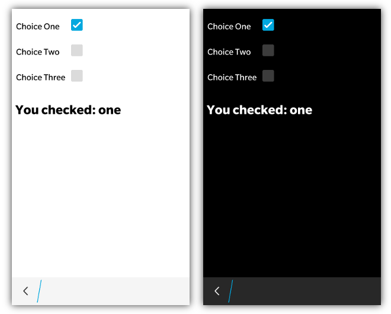

Checkboxes are quite easy to use in bbUI. Simply add regular &lt;input&gt; elements of type="checkbox" and you are good to go
```html
<input type="checkbox" checked="true" value="one" onchange="doSomething(this)" />
<input type="checkbox" value="two" onchange="doSomething(this)" />
<input type="checkbox" value="three" onchange="doSomething(this)" />
```
When using **BlackBerry 10 styling** this control will be displayed according to the UI specifications found on BlackBerry 10.  If you are using a checkbox input on BB6/BB7/PlayBook you will get the normal "Mozilla style" checkboxes.

When BlackBerry 10 styling is applied the highlight color of the checkbox will use the **highlightColor** provided in the toolkit init() function.

Note that any time the checkbox changes (either checked=true/false) the _onchange_ event will be fired.

## JavaScript Interface

_NOTE: The javascript interface is currently only supported with BlackBerry 10 Styling_

The following JavaScript interfaces are available for dynamically manipulating a Checkbox after the screen has been added to the DOM

### Dynamic Styling

A checkbox can be created dynamically to be inserted into a screen that is already in the live DOM _(after the ondomready event has fired for the screen)_. This allows you to dynamically create checkboxes on the fly based on user interaction. It is accomplished by using the bb.checkbox.style() function.

```javascript
// Create the element just like you would in a normal screen declaration
var checkbox = document.createElement('input');
checkbox.setAttribute('type','checkbox');
checkbox.setAttribute('value', 'foo');
checkbox.onclick = function() {
		alert(this.value);
	};

// Apply our styling
checkbox= bb.checkbox.style(checkbox);

// Insert it into the screen and update the scroller if on PlayBook
document.getElementById('checkboxContainer').appendChild(checkbox);
bb.refresh();

```

### setChecked(value) and getChecked()

A Checkbox can have its value set using the **setChecked()** function that takes a **boolean** value for the state of the checkbox.  

```javascript
    document.getElementById('mycheckbox').setChecked(true);
```

The checked state can either be retrieved by examining the **checked** value of the checkbox or by using the **getChecked()** function

```javascript
    alert(document.getElementById('mycheckbox').checked);
    alert(document.getElementById('mycheckbox').getChecked());
```

### show() and hide()

When you want to dynamically show or hide your checkbox you can call it&apos;s **show()** and **hide()** functions.

```javascript
	document.getElementById('myCheckbox').show();
	document.getElementById('myCheckbox').hide();
```

### remove()

As a convenience you can also remove your checkbox from the screen by calling the **remove()** function.

```javascript
	document.getElementById('myCheckbox').remove();
```

### enable() and disable()

You can disable in your checkbox by adding the **disabled="true"** attribute.  When you want to dynamically change the state of your checkbox you can call it&apos;s **enable()** and **disable()** functions.

```javascript
	document.getElementById('myCheckbox').enable();
	document.getElementById('myCheckbox').disable();
```