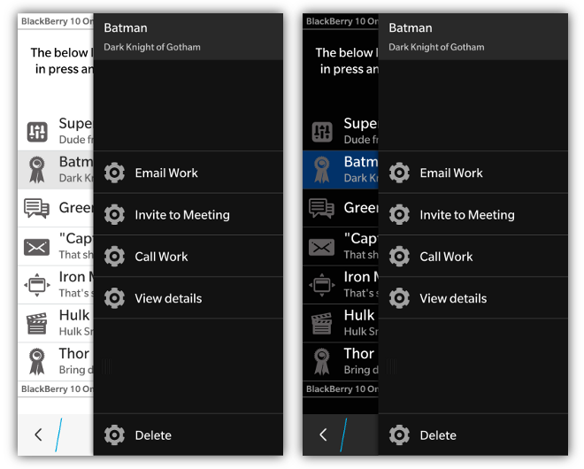

### BlackBerry 10 Prerequisites 

_**NOTE: Prerequisites are only necessary when using Context Menus on a BlackBerry 10 device, not with the BlackBerry 10 theme on PlayBook**_

To use bbUI Context Menus you must first setup your environment to use the [bbUI.js WebWorks extension](https://github.com/blackberry/bbUI.js/tree/master/pkg/bb10) for BlackBerry 10.

## Context Menus

BlackBerry 10 allows for a press and hold context menu that is very similar to the action bar overflow menu.  If you add one of these menus to your screen you can also automatically 
wire up your image lists and/or grid lists to the control.  _**NOTE: You can only have one context menu on a screen**_

When wired to an image list or grid list, pressing and holding on the image list item will "peek" the context menu and passing it the selected element.  Peeking the context menu will show the row of action icons that can be clicked and part of the context information in the header of the menu.

When the user swipes from right to left it will pull the full menu into view if they want to see the text labels for all the items.

Markup for the context menu looks a lot like the action bar markup.  You are able to create a **data-bb-type="context-menu"** that has a series of **data-bb-type="action"** elements.  An action item consists
of an image and text.  

The initial state of a context menu item can be set to invisible by using the **data-bb-visible="false"** attribute.

To react to the clicking of an action simply assign an **onclick** handler to the action element.
```html
<div data-bb-type="context-menu">
    <div data-bb-type="action" data-bb-img="local:///images/cog.png">Email Work</div>
    <div data-bb-type="action" data-bb-img="local:///images/cog.png" data-bb-visible="false">Invite to Meeting</div>
    <div data-bb-type="action" data-bb-img="local:///images/cog.png">Call Work</div>
    <div data-bb-type="action" data-bb-img="local:///images/cog.png">View details</div>
    <div data-bb-type="action" data-bb-img="local:///images/cog.png" onclick="alert('Delete');">Delete</div>
</div>
```

### Image Sizes

Images for actions on the context menu will be scaled the same as the action bar.

_**NOTE: Images paths should be local and start with local:///**_

* BlackBerry PlayBook - 40 x 40 pixels
* BlackBerry 10 - 100 x 100 pixels


## "Pinning" a Context Menu Action

There are scenarios where you have a specific action that you wish to call out in your context menu as something different or special ("Delete" is a good example).  To make this action stand out it can be "pinned" to the bottom of the menu away from your other actions. This can be done by providing the **data-bb-pin="true"** attribute for an action.
```html
<div data-bb-type="context-menu">
    <div data-bb-type="action" data-bb-img="local:///images/email.png">Email Work</div>
    <div data-bb-type="action" data-bb-pin="true" data-bb-img="del.png">Delete</div>
</div>
```

## JavaScript Interface

The following JavaScript interfaces are available for dynamically manipulating a Context Menu after the screen has been added to the DOM

### selected property

To grab the item that was selected from within your **onclick** of an action item.  This selected object is the one that was passed into the peek or show functions. The selected property returns a structure that looks like the following:

```javascript
{
  selected: DOMElement, // This is the DOM element that is selected by the user
  title: String,        // This is the title from the context menu
  description: String,  // This is the description from the context menu
}
```


You can refer to the **selected** property of the menu like in the following code:
```javascript
function myclick() {
    var selectedItem,
        context = document.getElementById('mycontextmenu');
   
    // context.menu.selected is the DOM element that was selected in the press-and-hold
    selectedItem  = context.menu.selected;
    if (selectedItem) {
        //... do something
    }
}
```

## Menu Item JavaScript Interface

The following JavaScript interfaces are available for dynamically manipulating a Context Menu Item after the screen has been added to the DOM

### setCaption(value) and setImage(value)

The caption and image of an action item can be changed using the **setCaption()** and **setImage()** functions.

```javascript

var myAction = document.getElementById('myAction');
myAction.setCaption('hello world');
myAction.setImage('images/newImage.png');

```

### show() and hide()

The visibility of an action item can be changed using the **show()** and **hide()** functions.

```javascript

var myAction = document.getElementById('myAction');
myAction.show();
myAction.hide();

```