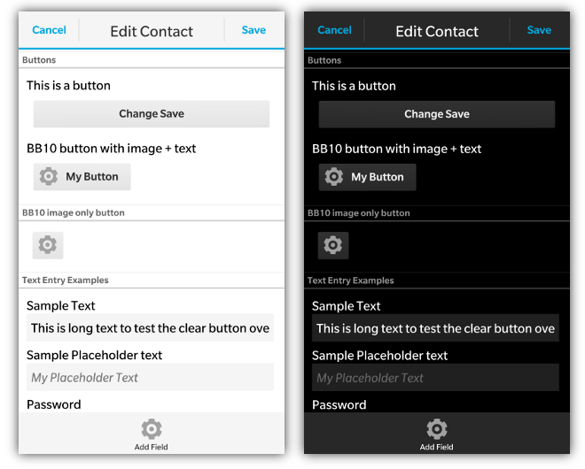

Rounded control panels are found on many of the standard BlackBerry applications. They typically group different controls together into logical groupings. Below is a screen shot of a control group that has a button and some progress indicators nested inside of it and a BlackBerry 10 control group example  



To declare a control panel you create a &lt;div&gt; with the **data-bb-type="round-panel"** attribute.  All content that you add to the inside of this &lt;div&gt; will appear inside the control panel. 

On BlackBerry 5/6/7/PlayBook these will appear as a rounded panel. With BlackBerry 10 styling they will appear as a section of the screen with a title at the top (if specified).

Control panels can either be a simple panel, or they can also have a title added to them.  To add a title add a &lt;div&gt; with the **data-bb-type="panel-header"** attribute.  The text contained inside of this div will show up as a header on the panel.  An example of what this header looks like can be seen in the Label/Control Container section below.
```html
<div data-bb-type="screen">
    <div data-bb-type="round-panel"> 
        <div data-bb-type="panel-header">My Header</div>
    
    </div>
</div>
```

## JavaScript Interface
The following JavaScript interfaces are available for dynamically manipulating a Control Group after the screen has been added to the DOM

### show() and hide()

When you want to dynamically show or hide your control group you can call it&apos;s **show()** and **hide()** functions.

```javascript
document.getElementById('myGroup').show();
document.getElementById('myGroup').hide();
```

### remove()

As a convenience you can also remove your control group from the screen by calling the **remove()** function.

```javascript
document.getElementById('myGroup').remove();
```