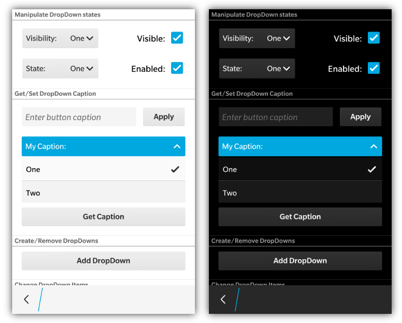
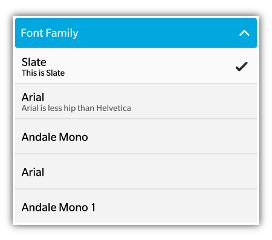

_**NOTE: bbUI DropDowns on BB5/BB6/B7 require BlackBerry WebWorks SDK v2.3 for BlackBerry OS Smartphones or higher. [See config.xml requirements for BB5/BB6/BB7 DropDowns](Config.xml-Requirements)**_


Dropdowns are created by adding a &lt;select&gt; element to your screen.  You can also set the **data-bb-style="stretch"** attribute to the &lt;select&gt; to have it stretch 
to the width of its container.  Add an "onchange" event to your &lt;select&gt; element to capture when the user changes their selection.  To specify the default
selected item when the control first shows you can can use the **selected="true"** attribute on the desired &lt;option&gt; element.
```html
<div data-bb-type="screen">
    <select data-bb-style="stretch" onchange="alert('changed')" id="fontfamily">
        <option value="bbalphasans" selected="true">BBAlpha Sans</option>
        <option value="arial">Arial</option>
        <option value="andalemono">Andale Mono</option>
    </select>
</div>
```
BlackBerry 10 has an additional feature where you can specify a **data-bb-label="my label"** to have the label text appear in the dropdown control.

### BlackBerry 10 Extra features



If you would like to add a secondary line of text for the value of the &lt;option&gt; displayed when the DropDown is opened, you can provide a **data-bb-accent-text** attribute for the option.

```html
<select>
   <option value="bbalphasans" selected="true" data-bb-accent-text="You Betcha!">BBAlpha Sans</option>
   <option value="arial" data-bb-accent-text="Giddy-up!">Arial</option>
</select>
```

## JavaScript Interface

The following JavaScript interfaces have been added for dynamically manipulating, or creating, a DropDown after the screen has been added to the DOM.

### Dynamic Styling

A DropDown can be created dynamically to be inserted into a screen that is already in the live DOM (after the ondomready event has fired for the screen).  This allows you to dynamically create DropDowns on the fly based on user interaction.  It is accomplished by using the **bb.dropdown.style()** function.

```javascript
// Create the element just like you would in a normal screen declaration
var option,
    dropDown = document.createElement('select');
dropDown.setAttribute('data-bb-label','Delete Me?');
	
// Create our options for the select
option = document.createElement('option');
option.setAttribute('value','1');
option.setAttribute('selected','true');
option.innerHTML = 'No';
dropDown.appendChild(option);
option = document.createElement('option');
option.setAttribute('value','2');
option.innerHTML = 'Yes';
dropDown.appendChild(option);
	
// Assign a change handler if needed
dropDown.onchange = function() {
		if (this.value == 2) {
			this.remove();
		} 
	};
		
// Apply our styling
dropDown = bb.dropdown.style(dropDown);
	
// Insert it into the screen and update the scroller
document.getElementById('dropdownContainer').appendChild(dropDown);
bb.refresh();

```

### setSelectedItem(value)

To select an item in a dropdown from JavaScript you can use the **setSelectedItem()** function that has been added to the &lt;select&gt; object. In many browsers, the **onchange** event
is not fired on a &lt;select&gt; if the value is set from JavaScript.  Only if it is set from the interaction with the UI.  Because of this bbUI cannot listen to the change made 
from outside JavaScript and apply the styling in the UI. When you call the **setSelectedItem()** method, the **onchange** of the select will also fire.

An example of how to select an item of the &lt;select&gt; element seen in the above sample is as follows:
```javascript
    document.getElementById('myDropDown').setSelectedItem(1); //Parameter is the index of the item in the list
```

### setSelectedText(value)

To set the value of a DropDown by using the text value of an option instead of the option's index, you can use the **setSelectedText()** function.

```javascript

document.getElementById('myDropDown').setSelectedText('Batman Option');

```

### enable() and disable()

To enable or disable your DropDown control you can use the **enable()** and **disable()** functions

```javascript

document.getElementById('myDropDown').enable();
document.getElementById('myDropDown').disable();

```

### show() and hide()

You can also make your DropDown visible or invisible by using the **show()** and **hide()** convenience functions. These ensure that the proper styling is applied to the controls based on their layout.

```javascript

document.getElementById('myDropDown').show();
document.getElementById('myDropDown').hide();

```

### remove()

A convenience function to remove your DropDown from the screen is also available

```javascript

document.getElementById('myDropDown').remove();

```

### setCaption(value) and getCaption()

For BlackBerry 10 styling, you can dynamically retrieve or change the caption/label for your DropDown by using the **setCaption()** and **getCaption()** functions

```javascript

document.getElementById('myDropDown').setCaption('Batman');
alert(document.getElementById('myDropDown').getCaption());

```

### refresh()

Whenever you want to update the options for a DropDown, you must first manipulate the &lt;option&gt; elements of the &lt;select&gt; input, and then call the **refresh()** function.  This will refresh all the items in the DropDown including the currently selected option.

```javascript

// Find out dropdown and add a new option
var dropdown = document.getElementById('refreshTarget'),
	count = dropdown.options.length + 1,
	option = document.createElement('option');
option.setAttribute('value',count);
option.innerHTML = count;
dropdown.appendChild(option);
	
// Refresh the dropdown
dropdown.refresh();

```