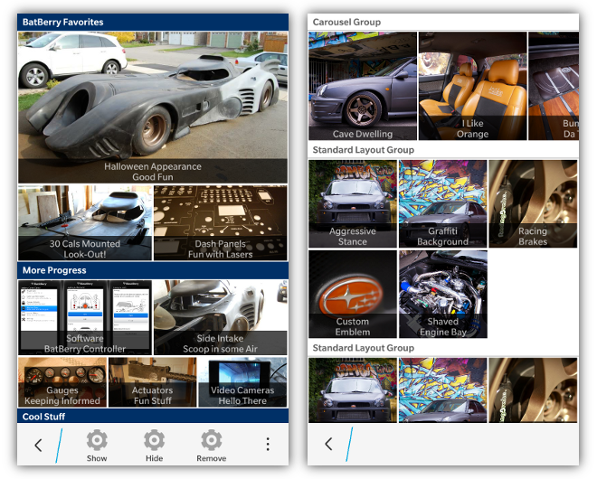
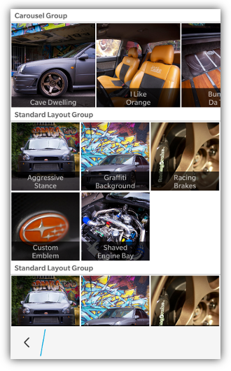

Grid layouts allow you to present your information in a graphical and cinematic way.  **Grid layouts are currently only supported on PlayBook and BB10 devices**. 



If you have multiple images to show you can arrange them in groups and rows. A grouping of information can have a header title which is covered below. Highlights of items will use the **highlightColor** provided [in the bb.init() function](Toolkit-Initialization)

Each group has one or more rows. Each row can have up to 3 items.  The layout by default assumes that images are a 16:9 aspect ratio, or you can set the **data-bb-style="square"** attribute to make the images be scaled to a 1:1 aspect ratio. 

If a row has only one item in it, it's width will be the full width of the size of the grid.  A row with 2 items will be 1/6, and 3 items will be 1/9 the height of the screen.  All images are currently set to be stretched to the size of their container.

Every item in the grid has an **image**, a **title** and a **sub-title** (which is provided as the innerHTML of the &lt;div&gt;).  If both the title and sub-title are not provided, there will be no title translucent overlay applied to the grid item. Each item can also provide an **onclick** handler for when the user 
selects the item.
```html
<div data-bb-type="grid-layout">
    <div data-bb-type="group" data-bb-title="My Title">
        <div data-bb-type="row">
            <div data-bb-type="item" data-bb-img="1.jpg" data-bb-title="Hello" onclick="alert('You clicked me');">World</div>
        </div>
        <div data-bb-type="row">
            <div data-bb-type="item" data-bb-img="2.png" data-bb-title="Hello">World</div> 
            <div data-bb-type="item" data-bb-img="3.jpg" data-bb-title="Hello">World</div> 
        </div>
    </div>
    <div data-bb-type="group" data-bb-title="My Title">
        <div data-bb-type="row">
            <div data-bb-type="item" data-bb-img="4.jpg" data-bb-title="Hello">World</div>		
            <div data-bb-type="item" data-bb-img="5.jpg" data-bb-title="Hello">World</div> 
            <div data-bb-type="item" data-bb-img="6.jpg" data-bb-title="Hello">World</div>
        </div>
    </div>
</div>
```

### Rows and Columns

If you wish to have a specified number of columns in a row you can use the **data-bb-columns** attribute.  By specifying a number of columns, all items in that row will be sized based on the number of columns instead of the number of items.  

If number of columns is specified: **item width = 1/#cols**

If number of columns is not specified: **item width = 1/#items**

**NOTE:** If you have more items in your row than what you have specified in **data-bb-columns** the following will occur:

* On PlayBook items that appear past the specified number of columns will not be displayed.
* On a BlackBerry 10 device, the images will be displayed in a horizontal carousel mode which is detailed in the **Carousel Mode** section 

If you have **fewer items** in your row than what has been specified in the **data-bb-columns** the items will be left justified and there will be trailing spaces.

**Example:**

```html
<div data-bb-type="grid-layout">
    <div data-bb-type="group" data-bb-title="My Title">
        <div data-bb-type="row" data-bb-columns="2"> 
            <div data-bb-type="item" data-bb-img="1.jpg" data-bb-title="Hello">World</div>
            <div data-bb-type="item" data-bb-img="2.png" data-bb-title="Hello">World</div> 
            <div data-bb-type="item" data-bb-img="3.jpg" data-bb-title="Hello">World</div> 
        </div>
        <div data-bb-type="row" data-bb-columns="2"> 
            <div data-bb-type="item" data-bb-img="1.jpg" data-bb-title="Hello">Sea</div>
        </div>
    </div>
</div>
```

**Will create the following layout:**

**Row1:** IMG1 | IMG2  (IMG3 not displayed on PlayBook and IMG1 &amp; IMG2 will take up 50% each of the grid's width)

**Row2:** IMG1 | GAP   (IMG1 will be left justified and take up 50% of the grid's width with a gap to the right)

## Headers

Groups in a grid list can also specify a header. A header is declared by adding a **data-bb-title="my title"** attribute to the group.  Headers have their text centered by default.  To left justify your header text add the **data-bb-header-justify="left"** or to right justify your text add the **data-bb-header-justify="right"**attribute to your grid.

You can also specify if you want your headers to be a solid color, or the default gradient.  To use solid headers simply add the **data-bb-header-style="solid"** attribute to your grid list.
```html
<div data-bb-type="grid-layout" data-bb-header-justify="left" data-bb-header-style="solid">
    <div data-bb-type="group" data-bb-title="My Title">
        <div data-bb-type="row">
            <div data-bb-type="item" data-bb-img="1.jpg" data-bb-title="Hello">World</div>
        </div>
    </div>
</div>
```

## Context Menu Integration

If you want to attach a BlackBerry 10 context menu to your grid list you can add the **data-bb-context="true"** attribute.  This will automatically hook up your grid list to the press and hold context menu that you have declared for the screen.  When the grid list item is pressed and held for 667ms it will **peek** the screen's context menu passing the title and sub-title of the grid item along with a handle to the item element.  See the [Context Menu](Context-Menus) area for more details of interacting with the menu.  

## Carousel Mode



On BlackBerry 10 devices you can use the grid list to create a horizontal carousel that allows for scrolling items left and right. _NOTE: This is only available for BlackBerry 10 devices and not PlayBook devices using the BB10 styling.  The PlayBook 2.x browser doesn't support this properly_

To create a carousel, simply use the **data-bb-columns** attribute to specify the number of items that you wish to be visible to the user at one time.  Then add more items to the row than the number specified in **data-bb-columns**.  This will create an overflow in the row and the grid will allow the user to scroll horizontally through the row items.

In order to ensure that the user knows that there are items available for scrolling, the items are sized slightly smaller than usual to show 1/2 of the next item off screen.

Here is an example of how to create a row that provides a horizontal carousel:

```html
<div data-bb-type="grid-layout">
    <div data-bb-type="group" data-bb-title="My Carousel">
        <div data-bb-type="row" data-bb-columns="2"> 
            <div data-bb-type="item" data-bb-img="1.jpg" data-bb-title="Hello">World</div>
            <div data-bb-type="item" data-bb-img="2.png" data-bb-title="Hello">World</div> 
            <div data-bb-type="item" data-bb-img="3.jpg" data-bb-title="Hello">World</div> 
            <div data-bb-type="item" data-bb-img="4.jpg" data-bb-title="Hello">World</div> 
        </div>
    </div>
</div>
```

## JavaScript Interface
The following JavaScript interfaces are available for dynamically manipulating a Grid after the screen has been added to the DOM

### show() and hide()

When you want to dynamically show or hide your grid list you can call it&apos;s **show()** and **hide()** functions.

```javascript
document.getElementById('myGrid').show();
document.getElementById('myGrid').hide();
```

### remove()

As a convenience you can also remove your grid from the screen by calling the **remove()** function.

```javascript
document.getElementById('myGrid').remove();
```