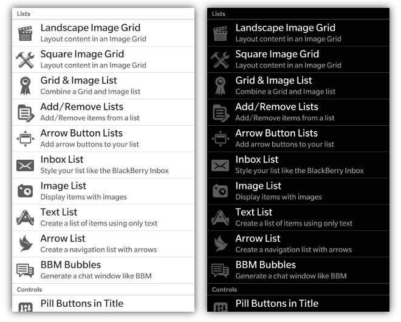
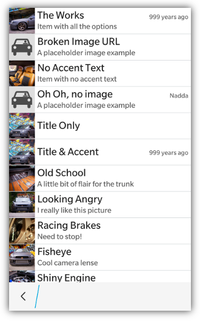
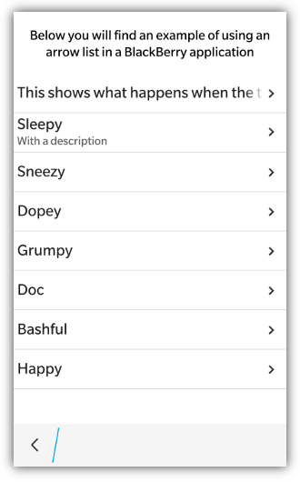
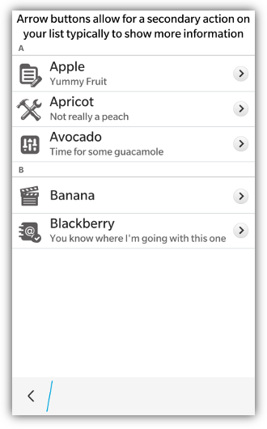
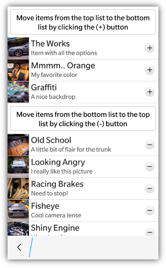

 

Creating an image list is really simple and begins with creating a &lt;div&gt; that has the attribute **data-bb-type="image-list"**.  Each item in the list is another &lt;div&gt; that has the attribute **data-bb-type="item"**.  Each item has an image (**data-bb-img**), a title (**data-bb-title**), accent text that floats in the top right (**data-bb-accent-text**), and a description which is the innerHTML of the &lt;div&gt;. 

Image lists can be defined as one of 5 different styles specified by the **data-bb-style** attribute. These styles can be one of **default | arrowlist | arrowbuttons | addbuttons | removebuttons**.  Not specifying this attribute, or specifying **default** will create an ordinary image list. 

```html
<div data-bb-type="screen">
    <div data-bb-type="image-list">
        <div data-bb-type="item" data-bb-img="icon1.png" data-bb-title="Title">Description</div>
        <div data-bb-type="item" data-bb-img="icon2.png" data-bb-title="Title" data-bb-accent-text="Accent Text">Description</div> 
        <div data-bb-type="item" data-bb-img="icon3.png" data-bb-title="Title">Description</div> 
    </div>
</div> 
```
To add a click event to one of the line items, simply add an onclick event to the &lt;div&gt;
```html
<div data-bb-type="item" onclick="alert('clicked')" data-bb-img="icon9.png" data-bb-title="Title">Description</div> 
```

### Image Sizes

* BlackBerry 5 &amp; 6 - 60 x 60 pixels 
* BlackBerry PlayBook &amp; BlackBerry 7 - 70 x 70 pixels
* BlackBerry PlayBook with BB10 styling - 64 x 64 pixels
* BlackBerry 10 - 109 x 109 pixels

## Headers

An image list can have both headers and line items. A header is declared by creating a &lt;div&gt; with a **data-bb-type="header"** attribute and the innerHTML contents of the &lt;div&gt; are displayed as the label of the header.  Headers have their text centered by default.  To left justify your header text add the **data-bb-header-justify="left"** or to right justify your text add the **data-bb-header-justify="right"**attribute to your image list.

For BlackBerry 10 you can also specify if you want your header to be a solid color, or the default gradient.  To use solid headers simply add the **data-bb-header-style="solid"** attribute to your image list.
```html
<div data-bb-type="image-list" data-bb-header-justify="left" data-bb-header-style="solid">
    <div data-bb-type="header">My Header</div>
    <div data-bb-type="item" data-bb-img="icon9.png" data-bb-title="Title">Description</div> 
</div>
```

## Image Options and Effects

If you want a simple list without images you can set the **data-bb-images="none"** attribute on your image list
```html
<div data-bb-type="image-list" data-bb-images="none">
    
</div>
```
You can also specify _placeholder_ images that are used for when you don't have an image to represent the list item, or if the url to your list item is broken.  This can be done by setting the **data-bb-image-placeholder** attribute with the path to your placeholder image
```html
<div data-bb-type="screen">
    <div data-bb-type="image-list" data-bb-image-placeholder="placeholder.png">
        <div data-bb-type="item" data-bb-title="Title">No Image</div>
        <div data-bb-type="item" data-bb-img="/unreachable/image.png" data-bb-title="Title">Unreachable</div>
    </div>
</div> 
```


For BlackBerry 10 styling you can also specify a _loading_ image to be used while your remote images are being loaded.  This is useful for when your images are being retrieved from a remote server and you want to let the user know that the data is being retrieved.  This can be done by setting the **data-bb-image-loading** attribute with the path to your loading image.  Once the image for the list item has been retrieved it will replace the loading image.

```html
<div data-bb-type="screen">
    <div data-bb-type="image-list" data-bb-image-loading="loading.png">
        <div data-bb-type="item" data-bb-title="Title">My Image</div>
        <div data-bb-type="item" data-bb-img="http://long/loading/image.png" data-bb-title="Title">Taking a long time</div>
    </div>
</div> 
```

## Context Menu Integration

If you want to attach a BlackBerry 10 context menu to your image list you can add the **data-bb-context="true"** attribute.  This will automatically hook up your image list to the 
press and hold context menu that you have declared for the screen.  When the image list item is pressed and held for 667ms it will **peek** the screen's context menu passing the 
title and description of the list item along with a handle to the item element.  See the [Context Menu](Context-Menus) area for more details of interacting with the menu.  

_**NOTE: The context menu integration with the image list only works on BlackBerry 10**_

## Arrow Lists

An Arrow list is typically used as a navigation menu.  To create an arrow list simply set the **data-bb-style="arrowlist"** attribute.  This will create a right aligned chevron/arrow beside each list item.



## Button Lists

An button list is typically used when you want to list information but also have a button on the list item that will perform a different action than clicking the item itself.  This type of list can be created by specifying **arrowbuttons | addbuttons | removebuttons** for the **data-bb-style** attribute.  The _arrowbuttons_ value will create chevron/arrow (>) buttons on the far right of each list item.  The _addbuttons_ value will create (+) buttons on the far right of each list item.  The _removebuttons_ value will create (-) buttons on the far right of each list item.

To trap the click of this list button you can simply add an **onbtnclick** event to your list item.
```html
<div data-bb-type="image-list" data-bb-style="addbuttons">
    <div data-bb-type="item" data-bb-img="1.jpg" onbtnclick="addItem()" data-bb-title="Title">Description</div>	
    <div data-bb-type="item" data-bb-img="2.jpg" onbtnclick="addItem()" data-bb-title="Title">Description</div>
</div>
```
Button lists are _ONLY_ supported with BlackBerry 10 styling.



## Image List JavaScript Interface

The following JavaScript interfaces are available for dynamically manipulating an Image List after the screen has been added to the DOM

### refresh()

The absolute fastest way to add items to an image list after it has been added to the DOM is by calling the **refresh()** function.  This function takes in an array of item DOMElement(s) that will all be styled in the background and inserted in one chunk. This ensures that there are only 2 layout computations needed to add as many items as you like to a list.

```javascript
var items = [],
      item;

// Create the item's DOM in a fragment
for (var i = 0; i < 5; i++) {
  item = document.createElement('div');
  item.setAttribute('data-bb-type','item');
  item.setAttribute('data-bb-title','my title');
  item.innerHTML = 'my description';
  item.setAttribute('data-bb-img','foo.png');
  item.onclick = function() {alert('clicked');};
  items.push(item);
}

document.getElementById('mylist').refresh(items);
```

### show() and hide()

When you want to dynamically show or hide your image list you can call it&apos;s **show()** and **hide()** functions.

```javascript
document.getElementById('myList').show();
document.getElementById('myList').hide();
```

### remove()

As a convenience you can also remove your image list from the screen by calling the **remove()** function.

```javascript
document.getElementById('myList').remove();
```

### selected property

You can retrieve the selected item from a list by using the **selected** property when the user clicks on an item or button in the list.

```javascript
var selectedItem = document.getElementById('mylist').selected;
```

### getItems()

The **getItems()** function returns an array of items currently in the list.  This is a _disconnected array_. Manipulating the array will have no effect on the list.
```javascript
// Retrieve our list
var items = document.getElementById('mylist').getItems();
alert(items.length);
```

### appendItem(value)

The **appendItem( item )** function allows you to add an item to the end of the list.
```javascript
// Create the item's DOM in a fragment
var item = document.createElement('div');
item.setAttribute('data-bb-type','item');
item.setAttribute('data-bb-title','my title');
item.innerHTML = 'my description';
item.setAttribute('data-bb-img','foo.png');
item.onclick = function() {alert('clicked');};
    
// Append to list
document.getElementById('mylist').appendItem(item);
```

### insertItemBefore(new, existing)

The **insertItemBefore( newItem, existingItem )** function allows you to insert an item before an existing item in the list.
```javascript
// Create the item's DOM in a fragment
var item = document.createElement('div');
item.setAttribute('data-bb-type','item');
item.setAttribute('data-bb-title','my title');
item.innerHTML = 'my description';
item.setAttribute('data-bb-img','foo.png');
item.onclick = function() {alert('clicked');};
    
// Retrieve our items in the list
var list = document.getElementById('mylist'),
    items = list.getItems();

// Add our item before the first item in the list
if (items.length > 0) {
    list.insertItemBefore(item, items[0]);
} else {
    list.appendItem(item);
}
```

### clear()

You can use the **clear()** function for image lists to quickly clear all the items and reset the scrolling area

```javascript
document.getElementById('mylist').clear();
```

### Common scenario

One common use case scenario is to retrieve the **id** of an image list item when the user clicks on the item. The below code will show you how you can retrieve the item's id

```html
<div data-bb-type="item" data-bb-img="1.jpg" onbtnclick="alert(this.getAttribute('id'))" data-bb-title="Title"> </div>
```


## List Item JavaScript interface

The following JavaScript interfaces are available for dynamically manipulating an Image List Item after the screen has been added to the DOM

### getTitle(), getDescription(), getAccentText() and getImage()

You can retrieve the values for an image list item by using the following functions
```javascript
getTitle()        // Returns title of item
getDescription()  // Returns the description of the item
getAccentText()   // Returns the accent text of the item
getImage()        // Returns the path of the image used
```

### remove()

You can also remove an item from its list by calling the item's **remove()** function.
```javascript
var selected = document.getElementById('mylist').selected;
selected.remove();
```