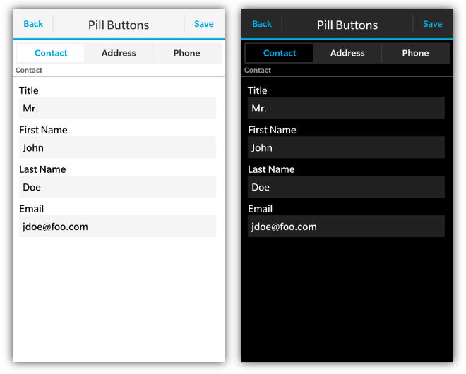

Pill Buttons can provide a "Tab Like" interface for quickly switching between multiple views of data.



Pill Buttons are a &lt;div&gt; with a **data-bb-type="pill-buttons"** attribute.  Each pill button is then added to the container by creating a &lt;div&gt; with a **data-bb-type="pill-button"** attribute. The caption the button is determined by the contents of the &lt;div&gt;.  The bbUI tookit knows which button is first and last to create the rounded ends of the pill button UI.  To handle the click of the button simply add an "onclick" handler.

To specify which button should be selected by default simply add the **data-bb-selected="true"** attribute to the default button.
```html
<div data-bb-type="screen">
    <div data-bb-type="pill-buttons">
        <div data-bb-type="pill-button" data-bb-selected="true" onclick="selectContact()">Contact</div>
        <div data-bb-type="pill-button" onclick="selectAddress()">Address</div>
        <div data-bb-type="pill-button" onclick="selectPhone()">Phone</div>
    </div>
</div>
```

## JavaScript Interface

The following JavaScript interfaces are available for dynamically manipulating Pill Buttons after the screen has been added to the DOM

### Dynamic Styling
_**NOTE: Currently only available for BB10 Styling**_

Pill buttons can be created dynamically to be inserted into a screen that is already in the live DOM (after the ondomready event has fired for the screen).  This allows you to dynamically create pill buttons on the fly based on user interaction.  This is accomplished by using the **bb.pillButtons.style()** function.

```javascript
// Create Pill Buttons
var pill= document.createElement('div');
pill.setAttribute('data-bb-type','pill-buttons');

// Create button
var btn = document.createElement('div');
btn.setAttribute('data-bb-type','pill-button');
btn.setAttribute('data-bb-selected','true');
btn.innerHTML = 'Option 1';
btn.onclick= function() {alert('foo');};
pill.appendChild(btn);

// Create button
btn = document.createElement('div');
btn.setAttribute('data-bb-type','pill-button');
btn.innerHTML = 'Option 2';
btn.onclick= function() {alert('foo');};
pill.appendChild(btn);

pill = bb.pillButtons.style(pill);

document.getElementById('buttonContainer').appendChild(pill);
```

### appendButton(element)
_**NOTE: Currently only available for BB10 Styling**_

You can dynamically append new buttons to your pill button control by using the **appendButton()** function. Essentially you create the DOM element markup for your button and then append it to a pre-existing Pill Button control.

```javascript
// Create button
var btn = document.createElement('div');
btn.setAttribute('data-bb-type','pill-button');
btn.innerHTML = 'Option 2';
btn.onclick= function() {alert('foo');};

document.getElementById('myPillButtonControl').appendButton(btn);
```

### show() and hide()

When you want to dynamically show or hide your pill buttons you can call it&apos;s **show()** and **hide()** functions.

```javascript
document.getElementById('myPillButtons').show();
document.getElementById('myPillButtons').hide();
```

### remove()

As a convenience you can also remove your pill buttons from the screen by calling the **remove()** function.

```javascript
document.getElementById('myPillButtons').remove();
```

### getButtons()

To retrieve all the buttons contained inside the pill button container you can use the **getButtons()** function which will return an array filled with the buttons.

```javascript
var buttons = document.getElementById('myPillButtons').getButtons();
alert('There are ' + buttons.length + ' buttons');
```

## Individual Button JavaScript Interface 

The following JavaScript interfaces are available for dynamically manipulating a Button within a Pill Button control after the screen has been added to the DOM

### getCaption() and setCaption(value)
_**NOTE: Currently only available for BB10 Styling**_

You can easily retrieve or set the caption of an individual Button in a Pill Button control by using the **getCaption()** and **setCaption()** functions.

```javascript
document.getElementById('myIndividualButton').setCaption('foo');
alert(document.getElementById('myIndividualButton').getCaption());
```