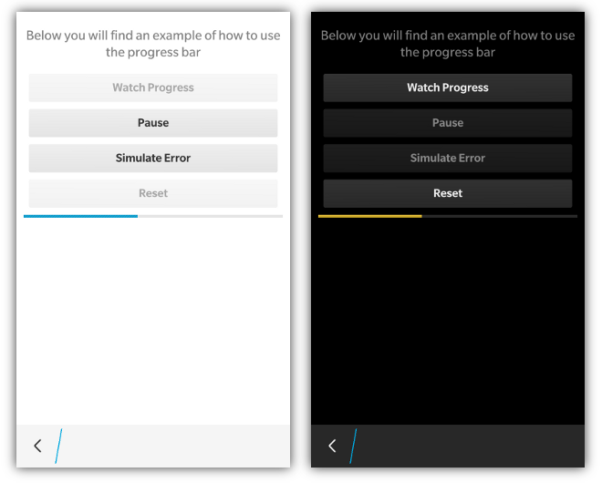

 

Progress Indicators are quite easy to use in bbUI. Simply add an HTML5 &lt;progress&gt; element and you are good to go
```html
<progress max="100" value="10"></progress>
```
The control will be displayed according to the UI specifications found on the target BlackBerry operating system. When styling is applied it will stretch the slider to 100% of the width of its containing element/div. The highlight color of the slider will use the **highlightColor** provided in the toolkit init() function for BlackBerry 10 and will use a standard green color for other BlackBerry operating systems.

You can use the max and value attributes to set the initial state of your indicator. 

## JavaScript Interface

The following JavaScript interfaces are available for dynamically manipulating a Progress Indicator after the screen has been added to the DOM

### Dynamic Styling

To dynamically create and style a progress indicator _(after the screen has been added to the DOM)_ you can use the **bb.progress.style()** function as shown in the below example:

```javascript
// Create progress indicator
var progress = document.createElement('progress');
progress.setAttribute('max','100');
progress.setAttribute('value','10');

// Style the indicator 
progress= bb.progress.style(progress);

// Insert into the LIVE DOM
document.getElementById('progressContainer').appendChild(progress);
```

### setValue(value)

To move the progress indicator there has been a **setValue(int)** function added to the &lt;progress&gt; element. This allows the value to be set and also apply the visual styling. _NOTE: When you set the value of the progress indicator it is best to do it with a **setTimeout** so that the UI thread gets a chance to paint._

```javascript
function setMyValue() {
   var value = 10;
   document.getElementById('myprogress').setValue(value);
}
```

### setState(value)

The state of a progress bar can be one of **NORMAL=0, PAUSED=1 or ERROR=2** using the **setState(state)** function. These constants have been added to the **bb.progress** object for convenience. 
```javascript
bb.progress.NORMAL
bb.progress.PAUSED
bb.progress.ERROR
```
By default the progress indicator is in the NORMAL state. When you set the progress indicator state to PAUSED, it will draw the indicator in a yellow color.  If you set the state of the progress indicator to ERROR, it will be drawn with a red color.
```javascript
document.getElementById('myIndicator').setState(bb.progress.PAUSED);
```

### show() and hide()

When you want to dynamically show or hide your progress indicator you can call it&apos;s **show()** and **hide()** functions.

```javascript
document.getElementById('myIndicator').show();
document.getElementById('myIndicator').hide();
```

### remove()

As a convenience you can also remove your progress indicator from the screen by calling the **remove()** function.

```javascript
document.getElementById('myIndicator').remove();
```

### setMax(value)

You can also change the max value of your progress indicator using the **setMax()** function

```javascript
document.getElementById('myIndicator').setMax(1337);
```