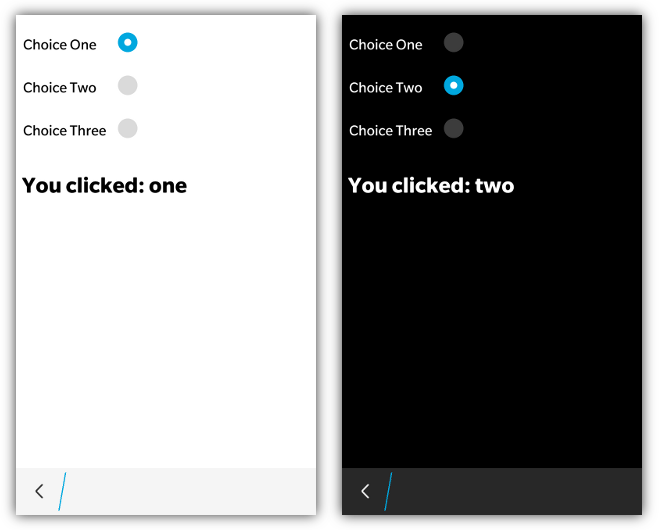

Radio buttons are quite easy to use in bbUI. Simply add regular &lt;input&gt; elements of type="radio" and you are good to go.
```html
<input type="radio" name="group1" checked="true" value="one" onchange="doSomething(this)" />
<input type="radio" name="group1" value="two" onchange="doSomething(this)" />
<input type="radio" name="group1" value="three" onchange="doSomething(this)" />
```
When using **BlackBerry 10 styling** this control will be displayed according to the UI specifications found on BlackBerry 10.  If you are using a radio input on BB6/BB7/PlayBook you will get the normal "Mozilla style" radio buttons.

When BlackBerry 10 styling is applied the highlight color of the radio button will use the **highlightColor** provided in the toolkit init() function.

Be sure to group your radio buttons together using the **name** attribute so that they properly change state.  Also note that any time the radio button changes (either checked=true/false) the _onchange_ event will be fired.

## JavaScript Interface

_NOTE: The javascript interface is currently only supported with BlackBerry 10 Styling_

The following JavaScript interfaces are available for dynamically manipulating a Radio Button after the screen has been added to the DOM

### Dynamic Styling

A radio button can be created dynamically to be inserted into a screen that is already in the live DOM _(after the ondomready event has fired for the screen)_.  This allows you to dynamically create radio buttons on the fly based on user interaction.  It is accomplished by using the **bb.radio.style()** function.

```javascript
// Create the element just like you would in a normal screen declaration
var radio = document.createElement('input');
radio.setAttribute('type','radio');
radio.setAttribute('name', 'group1');
radio.setAttribute('value', 'foo');
radio.onclick = function() {
		alert(this.value);
	};
// Apply our styling
radio = bb.radio.style(radio);
// Insert it into the screen and update the scroller
document.getElementById('radioContainer').appendChild(radio);
// Refresh for PlayBook
bb.refresh();
```

### setChecked() and getChecked()

A Radio Button can have its value set using the **setChecked()** function. Since there can only ever be one radio button selected in a group, the setChecked() function does not take any parameters, and will set the selected state of the radio button.

```javascript
document.getElementById('myradio').setChecked();
```

The checked state can either be retrieved by examining the **checked** value of the radio button or by using the **getChecked()** function

```javascript
alert(document.getElementById('myradio').checked);
alert(document.getElementById('myradio').getChecked());
```

### show() and hide()

When you want to dynamically show or hide your radio button you can call it&apos;s **show()** and **hide()** functions.

```javascript
document.getElementById('myRadio').show();
document.getElementById('myRadio').hide();
```

### remove()

As a convenience you can also remove your radio button from the screen by calling the **remove()** function.

```javascript
document.getElementById('myRadio').remove();
```

### enable() and disable()

You can disable in your radio button by adding the **disabled="true"** attribute.  When you want to dynamically change the state of your radio button you can call it&apos;s **enable()** and **disable()** functions.

```javascript
document.getElementById('myRadio').enable();
document.getElementById('myRadio').disable();
```

### isEnabled()

You can retrieve the enabled state by calling the **isEnabled()** function or checking the **disabled** attribute/property.

```javascript
alert(document.getElementById('myRadio').disabled);
alert(document.getElementById('myRadio').isEnabled());
```

### enableGroup(value) and disableGroup(value)

To enable or disable an entire group of radio buttons you can use the **enableGroup()** and **disableGroup()** functions by passing in the radio group name.

```javascript
bb.radio.enableGroup('myRadioButtonGroup');
bb.radio.disableGroup('myRadioButtonGroup');
```