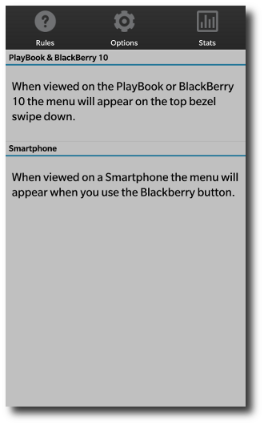
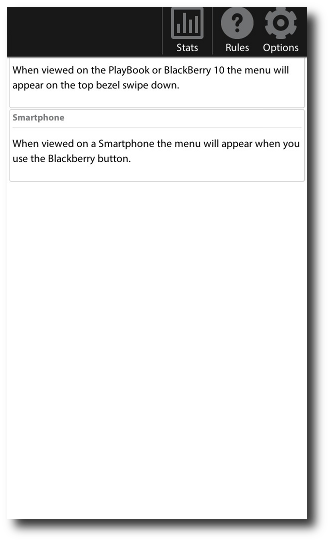
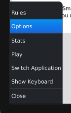

bbUI handles loading of screen specific menus on both PlayBook, BlackBerry 10 and Smartphones with the same code. Each screen must have a menu defined if you want it displayed. Clean-up occurs on bb.popScreen and bb.pushScreen.

<table>
<tr>
<td><b>BlackBerry 10</b></td>
<td><b>PlayBook</b></td>
<td><b>BlackBerry 5/6/7</b></td>
</tr>
<tr>
<td></td>
<td></td>
<td></td>
</tr>
</table>


**NOTE:** [See config.xml requirements for menus](Config.xml-Requirements)

Creating a menu is straight forward. Start by creating a &lt;div&gt; that has the attribute **data-bb-type="menu"**. Each item in the menu is another &lt;div&gt; that has the attribute **data-bb-type="menu-item"**. For a menu item to appear on PlayBook 2.x or BlackBerry 10 it must have **both** an image (data-bb-img) and a caption (innerHTML of the div) or it will be ignored. The on a Smartphone it must have a caption (data-bb-caption). In both cases the _onclick()_ event is the function 
that will fire when the menu item is selected.  On BlackBerry 5/6/7 smartphones you can add the attribute **data-bb-selected="true"** which makes that the default item when the menu is displayed.

There is an additional type of item you can use **data-bb-type="menu-separator"** which creates a menu separator on PlayBook 2.x and BlackBerry 5/6/7 smartphones.  

_NOTE: BlackBerry 10 will ignore separators and will only allow a maximum of 5 menu items_
```html
<div data-bb-type="screen">
    <div data-bb-type="menu">
        <div data-bb-type="menu-item" data-bb-img="icon1.png" onclick="foo();">Foo</div>
        <div data-bb-type="menu-item" data-bb-img="icon2.png" onclick="bar();" data-bb-selected="true">Bar</div>
        <div data-bb-type="menu-item" data-bb-img="icon3.png" onclick="fooBar();">FooBar</div>
        <div data-bb-type="menu-separator"></div>
        <div data-bb-type="menu-item" onclick="barFoo();">BarFoo</div>
    </div>
</div>
```

## BlackBerry 10 Specific Styling

As part of BlackBerry 10 styling you are able to **pin** two of you menu items to the left and right of the menu.  These are typically areas where you would place menu items for _Settings_, _Help_ or an _About_ menu item.

You can pin these two items by using the **data-bb-pin** attribute set to either **right** or **left**.  The first two items that specify right or left will be used and the rest will be ignored.

```html
<div data-bb-type="menu">
    <div data-bb-type="menu-item" data-bb-img="icon1.png" data-bb-pin="left">Help</div>
    <div data-bb-type="menu-item" data-bb-img="icon3.png">Settings</div>
    <div data-bb-type="menu-item" data-bb-img="icon2.png" data-bb-pin="right">About</div>
</div>
```

Another item to note, is that in the BlackBerry 10 UI guidelines it refers to having an application wide menu that is consistent.  The bbUI menu is tied to a screen, so you will want to replicate your menu across each of your screens.  It's recommended to add your menu to each screen in the **onscreenready** event.

## PlayBook and BlackBerry 10 menu image sizes

When styling is applied to menus on **BlackBerry 10** the images used for menus will be scaled to the following resolutions and centered on the menu items.

* BlackBerry PlayBook - 40 x 40 pixels
* BlackBerry 10 - 80 x 80 pixels

When styling is applied to menus on PlayBook 2.x with BlackBerry 10 styling turned off images will be scaled to the following resolutions and centered on the menu items.

* BlackBerry PlayBook 2.x - 65 x 65 pixels
	