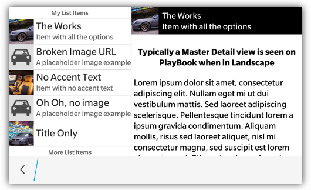

_NOTE: Scroll Panels are only supported on BlackBerry 10 and PlayBook_

Scroll panels allow you to specify an panel on your screen where the contents of the panel will scroll.  This is typically used in creating either a _master/detail_ style view (as seen in the picture above) or for creating fixed areas on your screen that have scrollable areas.

A scrolling panel is a &lt;div&gt; with a **data-bb-type="scroll-panel"** attribute.  **NOTE: In order for content to scroll in the panel, it must have a specified height.  Otherwise the panel will grow to the size of its inner content**

```html
<div data-bb-type="scroll-panel" style="height:450px">
       <!-- Some content -->
</div>
```

## JavaScript Interface

The following JavaScript interfaces are available for dynamically manipulating a Scroll Panel after the screen has been added to the DOM

### onscroll event

Scroll panels support an **onscroll** event.  If you want to know when the user is scrolling the panel content you can assign a handler to the onscroll event

```html
<div data-bb-type="scroll-panel" onscroll="doSomething()">
...
</div>
```

### refresh()

If you have manipulated the content of the scrolling panel via JavaScript you will want to call **refresh()** so that it can recalculate its scrolling dimensions.  _NOTE: This is only necessary for PlayBook_

```javascript
document.getElementById('myScrollingPanel').refresh();
```

### scrollTo(x,y)

You can also scroll to a specific **x,y** coordinate by using the **scrollTo()** function.  It takes both an **x** and **y** coordinate. The y coordinate is for future use, but currently isn't implemented.

```javascript
document.getElementById('myScrollingPanel').scrollTo(100,0);
```

### scrollToElement(value)

If you have an element in the scrolling panel that you would like to scroll to, you can use the **scrollToElement()** function.  This function takes in the **element** to scroll to.

```javascript
var element = document.getElementById('myitem');
document.getElementById('myScrollingPanel').scrollToElement(element);    
```

### show() and hide()

When you want to dynamically show or hide your scroll panel you can call it&apos;s **show()** and **hide()** functions.

```javascript
document.getElementById('myScroller').show();
document.getElementById('myScroller').hide();
```

### remove()

As a convenience you can also remove your scroll panel from the screen by calling the **remove()** function.

```javascript
document.getElementById('myScroller').remove();
```