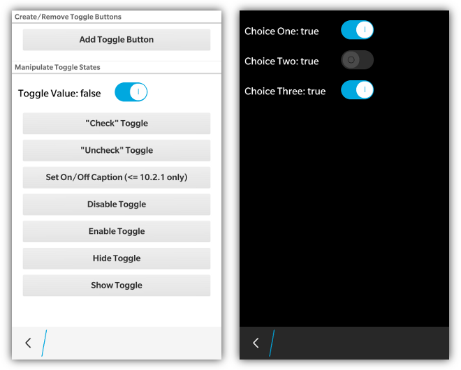

_NOTE: Toggle Buttons are only supported with BlackBerry 10 styling_

Toggle buttons are quite easy to use in bbUI. Simply add a &lt;div&gt; element with the **data-bb-type="toggle"** attribute and then specify your **true/false** wording by specifying a **data-bb-on="On"** and **data-bb-off="Off"** attribute.  You can provide whatever text you like for these captions.  If the text is too long it will be truncated in the display.

To set the initial **checked** state of the control you can provide a **data-bb-checked="true"** attribute.

```html
<div data-bb-type="toggle" data-bb-checked="true" data-bb-on="Yes" data-bb-off="No" onchange="doSomething(this)"></div>
<div data-bb-type="toggle" data-bb-on="On" data-bb-off="Off" onchange="doSomething(this)"></div>
<div data-bb-type="toggle" data-bb-on="Yes" data-bb-off="No" onchange="doSomething(this)"></div>
```

Note that any time the checkbox changes (either checked=true/false) the _onchange_ event will be fired.

When BlackBerry 10 styling is applied the highlight color of the toggle button will use the **highlightColor** provided in the toolkit init() function.

Toggle buttons can have their enabled state set by using the **data-bb-enabled** attribute to true.  This will display the toggle button in a disabled state.  This state can then be changed later using the **enable(), disable()** functions

```html
<div data-bb-type="toggle" data-bb-on="Yes" data-bb-off="No" data-bb-disabled="true"></div>
```

## JavaScript Interface

The following JavaScript interfaces are available for dynamically manipulating a Toggle Button after the screen has been added to the DOM

### Dynamic Styling

A toggle button can be created dynamically to be inserted into a screen that is already in the live DOM _(after the ondomready event has fired for the screen)_. This allows you to dynamically create toggle buttons on the fly based on user interaction. It is accomplished by using the bb.toggle.style() function.

```javascript
// Create toggle button
var toggle = document.createElement('div');
toggle.setAttribute('data-bb-type','toggle');
toggle.setAttribute('data-bb-on', 'On');
toggle.setAttribute('data-bb-off', 'Off');
toggle.onchange = function() {alert('foo');};
// Style it
toggle = bb.toggle.style(toggle);
// Insert it
document.getElementById('toggleContainer').appendChild(toggle);
```

### setChecked(value) and getChecked()

A toggle button can have its value set using the **setChecked()** function that takes a **boolean** value for the state of the toggle button.  

```javascript
document.getElementById('mytoggle').setChecked(true);
```

The checked state can either be retrieved by examining the **checked** value of the toggle button or by using the **getChecked()** function

```javascript
alert(document.getElementById('mytoggle').checked);
alert(document.getElementById('mytoggle').getChecked());
```

### show() and hide()

When you want to dynamically show or hide your toggle button you can call it&apos;s **show()** and **hide()** functions.

```javascript
document.getElementById('toggleBtn').show();
document.getElementById('toggleBtn').hide();
```

### enable() and disable()

Toggle Buttons can dynamically have their enabled state changed by calling the **enable()** and **disable()** functions.

```javascript
document.getElementById('toggleBtn').enable();
document.getElementById('toggleBtn').disable();
```

### remove()

As a convenience you can also remove your toggle button from the screen by calling the **remove()** function.

```javascript
document.getElementById('toggleBtn').remove();
```

### setOnCaption(value) and getOnCaption()

You can also get and set the **on** captions using the **setOnCaption(), getOnCaption()** functions.

```javascript
document.getElementById('toggleBtn').setOnCaption('Yes');
document.getElementById('toggleBtn').getOnCaption();
```

### setOffCaption(value) and getOffCaption()

You can also get and set the **off** captions using the **setOffCaption(), getOffCaption()** functions.

```javascript
document.getElementById('toggleBtn').setOffCaption('No');
document.getElementById('toggleBtn').getOffCaption();
```